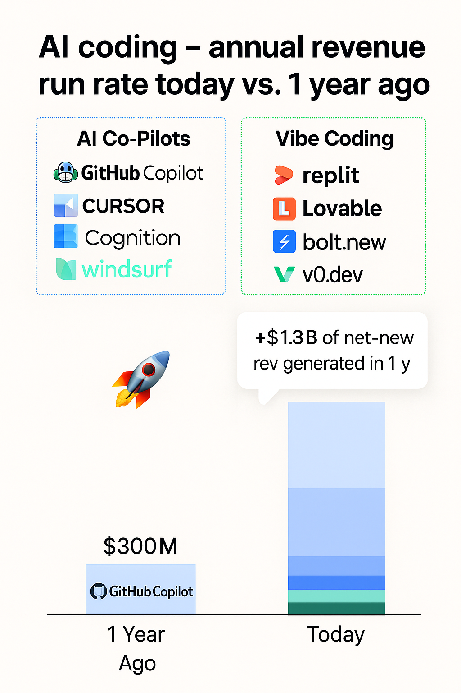

# ✨ Vibe Coding ✨

### Let's turn imagination into reality

**Chris Van Pelt, Weights & Biases**

---

## Who am I?

- Founding member of **Weights & Biases**
- Building AI dev tools in SF since 2006
- I ❤️ Vibe Coding

---

## What is Vibe Coding?

> "where you fully give in to the vibes, embrace exponentials, and forget that the code even exists"

**- Andrej Karpathy**

---

## The AI Coding Tool Explosion 🚀

This space is growing incredibly fast!

---

## Your AI Coding Toolkit

### Chat Agents
- ChatGPT Canvas
- Claude Artifacts*
- Gemini Canvas*

### Web Agents
- v0.dev
- lovable.dev
- bolt.new

### CLI Agents
- Claude Code
- OpenAI Codex CLI
- Gemini CLI

### IDE Agents
- Github CoPilot
- Cursor
- Windsurf

---

## Tips & Tricks

- **Geminiception:** Call Claude or Gemini [from within](https://simonwillison.net/2025/Jun/26/geminiception/) their own canvas/artifacts.
- **YOLO Mode:** For the brave and adventurous.
- **MCP:** Give your agents more tools.  [Puppeteer](https://github.com/modelcontextprotocol/servers/tree/c19925b8f0f2815ad72b08d2368f0007c86eb8e6/src/puppeteer) is excellent for giving app screenshots.
- **Checkpoints:** `gh` / `git` is your friend.  Ask the agent to commit their changes.
- **Linting & Testing:** Ask for linting and tests to give the model feedback on changes

---

## L33t Ultra Vibez

- **Prompt Engineering:** AGENTS.md, GEMINI.md, CLAUDE.md, Cursor rules... they are all :fire:
- **Reasoning:** Ask the model to "think carefully" for trickier problems.
- **Mobile:** [expo](https://expo.dev) is great for cross-platform mobile apps. [iOS Simulator MCP](https://github.com/joshuayoes/ios-simulator-mcp) == :rocket:
- **Commands:** [Custom Claude slash commands](https://docs.anthropic.com/en/docs/claude-code/slash-commands#custom-slash-commands) are :sunglasses:
- **Git worktrees:** Start [vibing in parallel](https://docs.anthropic.com/en/docs/claude-code/common-workflows#run-parallel-claude-code-sessions-with-git-worktrees)! Try giving `gemini`, `claude`, and `codex` the same task.

---

## Tonight's Goal

1.  **Create a small AI project** in a short time.
2.  Bonus points for intergrating **weave**
3.  Let's have fun and embrace the vibes!

---

## Coming Up Next...

### ⚡️ Demos ⚡️
### 🔥 Awards 🔥

---

## Let's get started!

### Questions?
